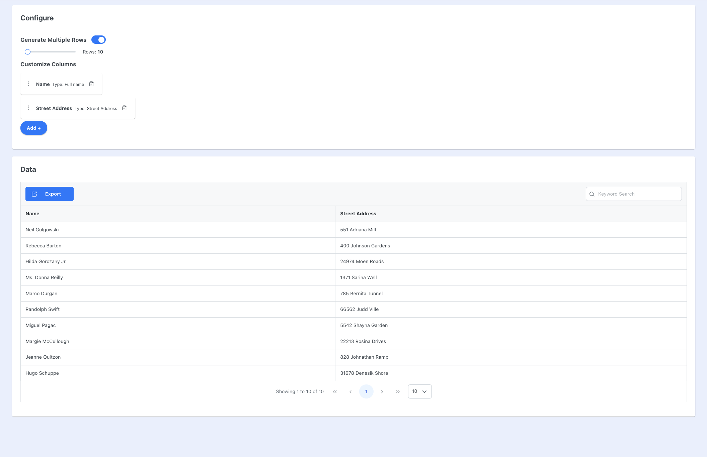
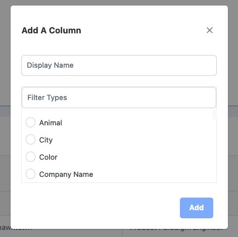

# Dataset Generator

This is a single page webapp that helps generate sets of data using Fakerjs.

## Technologies

This project uses Vue 3, using Pinia for state management. The data is generated using Fakerjs, with a predefined set of options that can be configured.  
It uses [PrimeVUE](https://www.primefaces.org/primevue/#/) as the component library.

## Images

**Default view**  
  
**Custom Columns**  
  
**Adding Additional Columns**  

